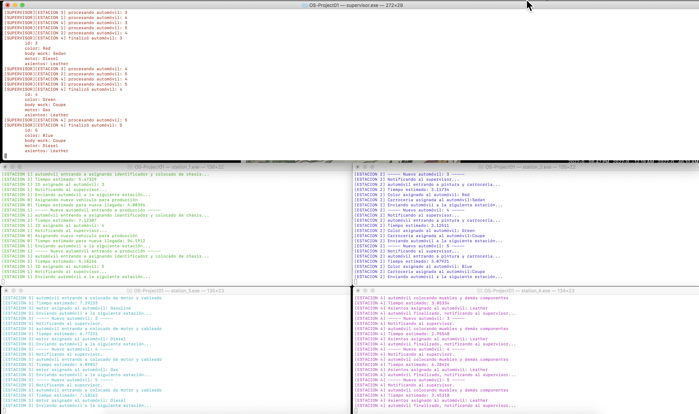

# OS-Project01

Este repositorio contiene el proyecto 1 de programación para la materia Sistemas Operativos, semestre A2022.

- Explicación de la implementación
- Instrucciones para compilar el código
- Instrucciones para ejecutar el código
- Demo

-----

### Explicación de la implementación

La arquitectura de la implementación consiste en lo siguiente: 

- Se modeló cada estación como un programa independiente. 

- Las estaciones se comunican utilizando comunicación entre procesos, específicamente utilizando colas del sistema operativo manejadas a través de la llamadas
al sistema: 
    - [`msgget`](https://man7.org/linux/man-pages/man2/msgget.2.html)
    - [`msgsnd`/`msgrcv`](https://linux.die.net/man/2/msgsnd)

- Los tiempos de espera se simulan utilizando: 
    - [`std::exponential_distribution<T>`](https://en.cppreference.com/w/cpp/numeric/random/exponential_distribution)
    - [`std::normal_distribution<T>`](https://en.cppreference.com/w/cpp/numeric/random/normal_distribution)

### Instrucciones para compilar el código

1. Clone el repositorio en su máquina local utilizando `git`.

2. Ejecute `make all` para compilar y obtener los siguientes ejecutables:
    - `station_1.exe`
    - `station_2.exe`
    - `station_3.exe`
    - `station_4.exe`

### Instrucciones para ejecutar el código

1. Ejecute los programas obtenidos, en diferentes terminales y en el siguiente orden:
    - `station_1.exe`
    - `station_2.exe`
    - `station_3.exe`
    - `station_4.exe`

Al seguir estos pasos, se podra apreciar a los 5 programas independientes colaborando entre sí para simular la 
fabricación de los automóviles en la fábrica:

### Demo
